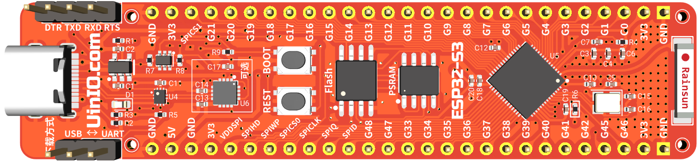

# UINIO-MCU-ESP32S3 核心板

[**UINIO-MCU-ESP32S3**](https://gitee.com/uinika/UINIO-MCU-ESP32S3) 是一款采用 [上海乐鑫科技](https://www.espressif.com.cn) **ESP32-S3** 微控制器的核心板电路设计，该微控制器基于 **Xtensa® dual-core 32-bit LX7** 架构，拥有 45 个 GPIO 接口，主频高达 `240MHz`，同时具备 **2.4GHz Wi-Fi** 与 **Bluetooth5** 两种物联网接入能力。片上载有 `384KB` 容量的 **ROM**，以及 `512KB` 容量的 **SRAM** 和 `16KB` 容量的 **RTCSRAM**。

## 设计概要

- 完整兼容官方的 [Arduino-ESP32](https://docs.espressif.com/projects/arduino-esp32/en/latest/) 板级支持包；
- 采用 LDO 低压差线性稳压芯片 `ME6211C33M5G` 提供 `3.3V` 电源；
- 预留 **TQFN** 封装的 USB 转 UART 串口芯片 **CH343P** 位置，可以按需进行贴装，不贴装时可以采用右上角的 4 线杜邦针外接串口下载模块；
- 预留有 2.4G 微带天线 **π 型阻抗匹配电路**位置，如果对于信号的收发功率没有严格要求，则可以将位号为 `L1` 的串联电感替换为 `0R` 电阻；
- 预留有 5 个 `1mm` 沉头螺丝开孔，可以用于固定主板和外壳；

## 注意事项

1. 上电之前不能下拉 `IO9/BOOT` 的电平状态，否则 **ESP32-S3** 将会进入**下载模式**；
2. `IO8` 引脚默认进行了上拉，因为如果其为低电平状态，则不能使用串口进行固件下载；
3. `GPIO11` 默认为 SPI 接口 Flash 存储器的 `VDD` 引脚，需要配置之后才能作为 GPIO 使用；
4. 外置的 `W25Q128JVSSIQ` 型 Flash 存储器，其 `VDD` 已经连接至 `3.3V` 电源，使用时无需再行配置，Flash 采用普通的两线制 SPI 总线进行通信；
5. `IO12`、`IO13` 在 **QIO** 模式下被复用为 SPI 信号线 `SPIHD` 和 `SPIWP`，本开发板采用两线制 SPI 的 **DIO** 模式，使用时需要注意将 Flash 配置为 **DIO** 模式；

## 参考技术文档

[UinIO.com 电子技术实验室](http://uinio.com/) 为 UINIO-MCU-ESP32S3 开源项目提供有如下一系列技术参考资料：

1. [《UINIO-MCU-ESP32 核心板电路设计》](http://www.uinio.com/Project/UINIO-MCU-ESP32/)
2. [《基于 UINIO-MCU-ESP32 的 Arduino 进阶教程》](http://www.uinio.com/Project/Arduino-ESP32/)
3. [《运用 U8G2 与 TFT_eSPI 玩转 UINIO-Monitor 显示屏》](http://www.uinio.com/Project/UINIO-Monitor/)
4. [《BOM 交互式物料清单与 PCB 布线在线预览》](http://uinio.com/archives/BOM/UINIO-MCU-ESP32S3.html)
