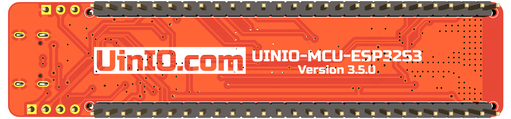

# UINIO-MCU-ESP32S3

这是一款基于 [**上海乐鑫科技**](https://www.espressif.com.cn) **ESP32-S3** 微控制器的评估板电路设计，该微控制器基于 **Xtensa® dual-core 32-bit LX7** 架构，拥有 45 个 GPIO 接口，主频高达 `240MHz`，同时支持 **2.4GHz Wi-Fi** 与 **Bluetooth5** 两种物联网接入方案。板载有 `384KB` 容量的 ROM，以及 `512KB` 容量的 SRAM 和 `16KB` 容量的 RTCSRAM。

## 评估板简介

- `3.3V` 电源了采用 `ME6211C33M5G` 低压差线性稳压器；
- 完整兼容官方的 [Arduino-ESP32](https://docs.espressif.com/projects/arduino-esp32/en/latest/) 板级支持包；
- 预留 **TQFN** 封装的 USB 转 UART 串口芯片 **CH343P** 位置，可以按需进行贴装，不贴装时可以采用左上角的 4 线排针外接其它串口模块进行下载；
- 预留有 2.4G 微带天线 **π 型阻抗匹配电路**的位置，如果对于信号强度没有严格要求，则可以将位号为 `L1` 的串联电感替换为 `0R` 电阻；
- 预留有 5 个 `1mm` 沉头螺丝开孔，可以用于固定主板和外壳；

## 使用注意事项

1. 上电之前不能下拉 `IO9/BOOT` 的电平状态，否则 ESP32-C3 将会进入**下载模式**；
2. `IO8` 引脚默认进行了上拉，因为如果其为低电平状态，则不能使用串口进行固件下载；
3. `GPIO11` 默认为 SPI 接口 Flash 存储器的 `VDD` 引脚，需要配置之后才能作为 GPIO 使用；
4. 外置的 `W25Q128JVSSIQ` Flash 存储器，其 `VDD` 已经连接至 `3.3V` 电源，使用时无需再行配置，Flash 采用普通两线制 SPI 进行通信；
5. `IO12`、`IO13` 在 **QIO** 模式下被复用为 SPI 信号线 `SPIHD` 和 `SPIWP`，本开发板采用两线制 SPI 的 **DIO** 模式，使用时需要注意将 Flash 配置为 DIO 模式；
